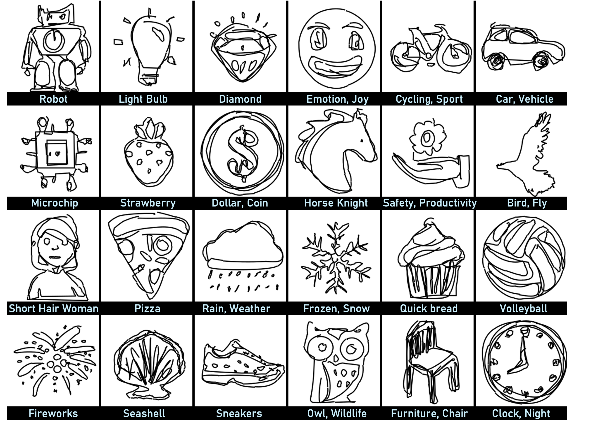
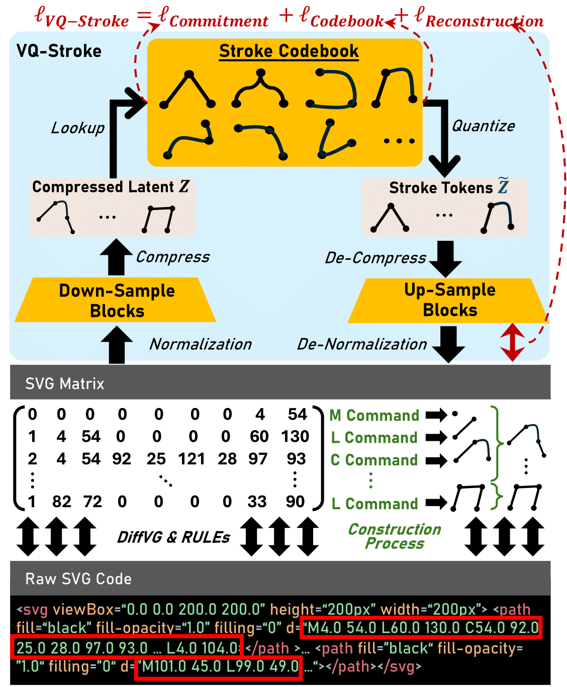
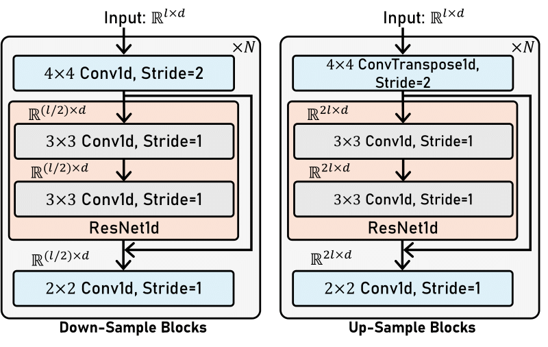
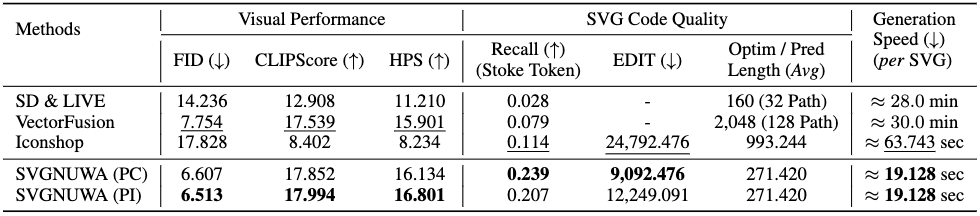

# StrokeNUWA: Tokenizing Strokes for Vector Graphic Synthesis
Implementation of the paper [StrokeNUWA: Tokenizing Strokes for Vector Graphic Synthesis](https://arxiv.org/abs/2401.17093), which is a pioneering work exploring a better visual representation ''stroke tokens'' on vector graphics, which is inherently visual semantics rich, naturally compatible with LLMs, and highly compressed.
<p align="center">  
    
</p>  

## Model Architecture
### VQ-Stroke
VQ-Stroke modules encompasses two main stages: “Code to Matrix” stage that transforms SVG code into the matrix format suitable for model input, and “Matrix to Token” stage that transforms the matrix data into stroke tokens.
<figure align="center">
  
  <figcaption>Overview of VQ-Stroke.</figcaption>
</figure>

<figure align="center">
  
  <figcaption>Overview of Down-Sample Blocks and Up-Sample Blocks.</figcaption>
</figure>


## Automatic Evaluation Results
<p align="center">  
    
</p> 


## Setup

We check the reproducibility under this environment.
- Python 3.10.13
- CUDA 11.1

### Environment Installation

Prepare your environment with the following command
```Shell
git clone https://github.com/ProjectNUWA/StrokeNUWA.git
cd StrokeNUWA

conda create -n strokenuwa python=3.9
conda activate strokenuwa

# install conda
conda install pytorch torchvision torchaudio pytorch-cuda=11.8 -c pytorch -c nvidia

# install requirements
pip install -r requirements.txt
```

### Model Preparation
We utilize [Flan-T5 (3B)](https://huggingface.co/google/flan-t5-xl) as our backbone. Download the model under the ``./ckpt`` directory.

### Dataset Preparation

#### [FIGR-8-SVG](https://github.com/marcdemers/FIGR-8-SVG) Dataset

Download the raw FIGR-8 dataset from [[Link]](https://github.com/marcdemers/FIGR-8-SVG) and follow [Iconshop](https://icon-shop.github.io/) to further preprocess the datasets. (We thank @[Ronghuan Wu](https://github.com/kingnobro) --- author of Iconshop for providing the preprocessing scripts.)

## Model Training and Inference

### Step 1: Training the VQ-Stroke
```Shell
python scripts/train_vq.py -cn example
```

### VQ-Stroke Inference
```Shell
python scripts/test_vq.py -cn config_test CKPT_PATH=/path/to/ckpt TEST_DATA_PATH=/path/to/test_data
```

### Step 2: Training the EDM
After training the VQ-Stroke, we first create the training data by inferencing on the full training data, obtaining the "Stroke" tokens and utilize these "Stroke" tokens to further training the Flan-T5 model.

We have provided an ``example.sh`` and training example data ``example_dataset/data_sample_edm.pkl`` for users for reference.


## Acknowledgement
We appreciate the open source of the following projects:

[Hugging Face](https://github.com/huggingface) &#8194;
[LLaMA-X](https://github.com/AetherCortex/Llama-X) &#8194;